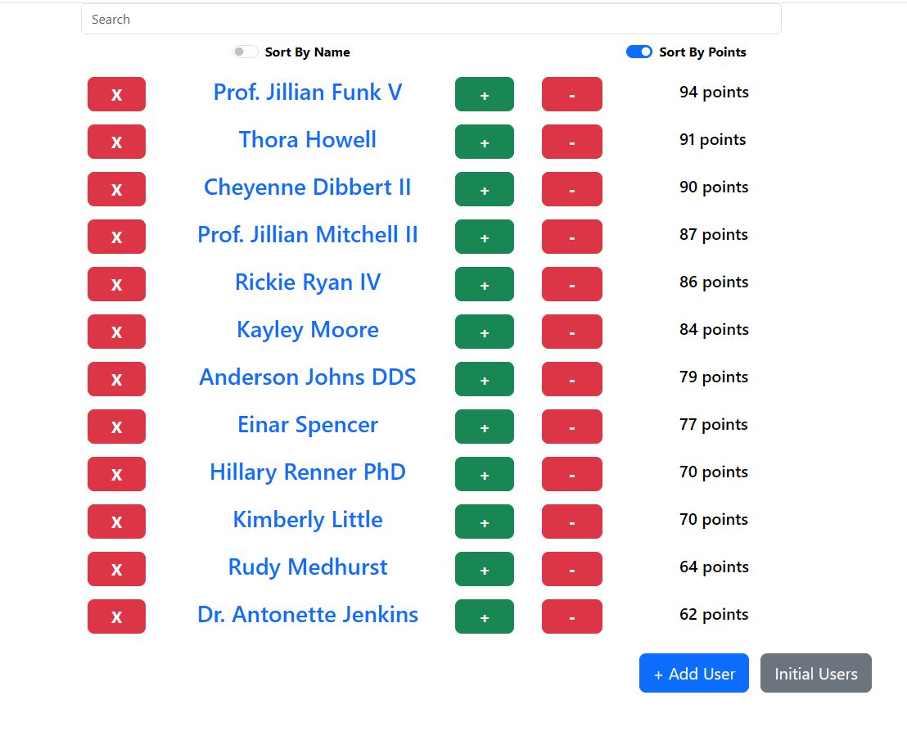
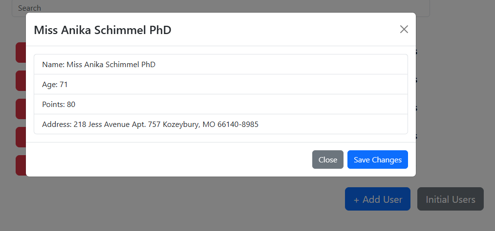

# Spring Financial App

## How to run

1. Set up DB ffrom .env file. (For this project I used a mySQL db)
```
DB_CONNECTION=mysql
DB_HOST=127.0.0.1
DB_PORT=3306
DB_DATABASE=springfinancialapp
DB_USERNAME=root
DB_PASSWORD=[password]
```

2. run `php artisan migrate` to create tables needed for app

3. run `npm i` and then `npm run dev` in one terminal

4. run `php artisan serve` in another terminal

5. Site should be running on localhost:8000

6. run `php artisan queue:work` to run jobs sent to queue

7. run `php artisan schedule:run` to run scheduled jobs

8. run `php artisan app:reset-scores` to run reset scores job

9. run `npm test` to run React tests

10. run `./vendor/bin/pest` to run laravel tests 

## Screenshot



## API Endpoints

- **GET /**  
  Renders the home page and returns a list of all users.

- **PUT /points/{user}**  
  Updates the points for a specific user.

- **POST /addUser**  
  Adds a new user.

- **DELETE /deleteUser/{user}**  
  Deletes a specific user.

- **GET /dashboard**  
  Renders the dashboard page (requires authentication and email verification).

- **POST /api/initialUsers**  
  Creates 5 initial users for the application.

- **GET /api/usersByPoints**  
  Returns user information grouped by score and includes the average age of the users.